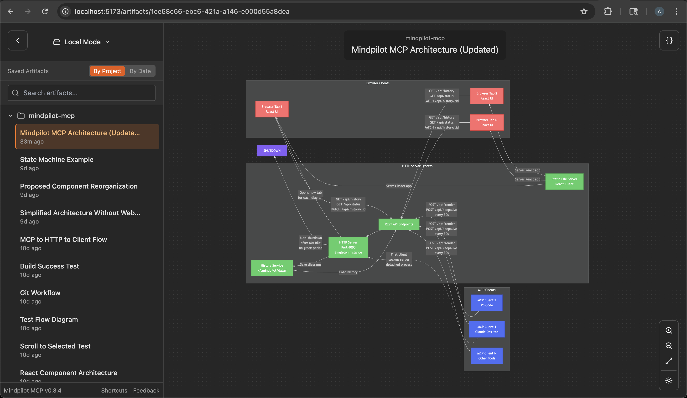

# Mindpilot MCP
See through your agent's eyes. Visualize legacy code, inspect complex subsystems, understand everything.

## ✨ Why Mindpilot MCP?
- **🧠 Visualize Almost Anything in Your Codebase**: Your MCP agent can instantly create code diagrams, architecture diagrams, process diagrams and more.
- **📊 Export & Share**: Save any diagram as SVG.
- **🔓 Local Processing**: Diagrams are never sent to the cloud. Everything stays between you, your agent, and your agent's LLM provider(s).

## 🚀 Quick Start

### Claude Code
`claude mcp add mindpilot-mcp -- npx @mindpilot/mcp@0.1.1`

### Cursor
TODO: Add configuration instructions

### VS Code
TODO: Add configuration instructions

### Windsurf
TODO: Add configuration instructions

## Using the MCP server
After configuring the MCP in your coding agent you can make requests like "create a diagram about x" and it should use the MCP server to render mermaid diagrams for you in a browser connected to the MCP server.

You can optionally update your agent's rules file to give specific instructions about when to use mindpilot-mcp.

### Example requests
- "Show me the state machine for websocket connection logic"
- "Create a C4 context diagram of this project's architecture."
- "Show me the oauth flow as a sequence diagram"

## How it works
Anthropic and OpenAI models are well trained to generate valid mermaid syntax. The MCP is designed to accept mermaid syntax and render diagrams in a browser app running on http://localhost:4000

## Development Configuration
Configure the MCP in your coding agent (using `claude` in this example)

`claude mcp add mindpilot-mcp -- npx tsx <path to...>/src/server/server.ts`

Run `claude` with the `--debug` flag if you need to see mcp errors

Start the development client (vite) to get hot module reloading while developing.

`npm run dev`

Open the development client
`localhost:5173`
