# Navigation Feature Visualizations

## Enhanced Navigation Features

```mermaid
graph TB
  subgraph "Mouse Navigation 🖱️"
    MW[Mouse Wheel]
    MW --> MWV[Regular Scroll<br/>↕ Vertical Pan]
    MW --> MWH[Shift + Scroll<br/>↔ Horizontal Pan]
    MW --> MWZ[Ctrl/Cmd + Scroll<br/>🔍 Zoom In/Out]
    
    MD[Mouse Drag]
    MD --> PAN[Click & Drag<br/>to Pan]
  end

  subgraph "Keyboard Navigation ⌨️"
    ARROWS[Arrow Keys]
    ARROWS --> UP[↑ Pan Up]
    ARROWS --> DOWN[↓ Pan Down]
    ARROWS --> LEFT[← Pan Left]
    ARROWS --> RIGHT[→ Pan Right]
    ARROWS --> DIAG[↖↗↙↘ Diagonal<br/>Multi-key Support]
    
    ZOOM[Zoom Keys]
    ZOOM --> PGU[PageUp<br/>🔍 Zoom In]
    ZOOM --> PGD[PageDown<br/>🔍 Zoom Out]
    ZOOM --> FIT[F Key<br/>⊡ Fit to Screen]
  end

  subgraph "Navigation Features ✨"
    SMOOTH[Smooth Movement]
    SMOOTH --> ACC[Acceleration<br/>on Hold]
    SMOOTH --> NORM[Diagonal<br/>Normalization]
    
    CONFIG[Configuration]
    CONFIG --> SPEED[Pan Speed: 8px]
    CONFIG --> ACCEL[Acceleration: 1.05x]
    CONFIG --> MAX[Max Speed: 25px]
  end

  subgraph "Implementation Details 🔧"
    HOOK1[usePanZoom Hook]
    HOOK1 --> WHEEL[Wheel Handler]
    HOOK1 --> MOUSE[Mouse Handlers]
    HOOK1 --> KEYPAN[handleKeyPan]
    
    HOOK2[useKeyboardPanning Hook]
    HOOK2 --> KEYSTATE[Key State Tracking]
    HOOK2 --> ANIM[Animation Frame]
    HOOK2 --> VEL[Velocity Calculation]
  end

  subgraph "User Experience 🎯"
    UX1[Natural Scrolling]
    UX1 --> SC1[Scroll = Pan<br/>(Expected Behavior)]
    
    UX2[Responsive Controls]
    UX2 --> SC2[Instant Response]
    UX2 --> SC3[Smooth Acceleration]
    
    UX3[Intuitive Modifiers]
    UX3 --> SC4[Shift for Horizontal]
    UX3 --> SC5[Ctrl for Zoom]
  end

  MW -.-> HOOK1
  ARROWS -.-> HOOK2
  HOOK2 -.-> KEYPAN
  SMOOTH -.-> HOOK2
  CONFIG -.-> HOOK2

  classDef coral fill:#ff6b6b,stroke:#c92a2a,color:#fff
  classDef ocean fill:#4c6ef5,stroke:#364fc7,color:#fff
  classDef forest fill:#51cf66,stroke:#2f9e44,color:#fff
  classDef sunshine fill:#ffd43b,stroke:#fab005,color:#000
  classDef grape fill:#845ef7,stroke:#5f3dc4,color:#fff
  classDef teal fill:#20c997,stroke:#12b886,color:#fff
  
  class MW,MD,ARROWS,ZOOM coral
  class MWV,MWH,MWZ,PAN,UP,DOWN,LEFT,RIGHT,DIAG,PGU,PGD,FIT ocean
  class SMOOTH,CONFIG,SPEED,ACCEL,MAX,ACC,NORM forest
  class HOOK1,HOOK2,WHEEL,MOUSE,KEYPAN,KEYSTATE,ANIM,VEL grape
  class UX1,UX2,UX3,SC1,SC2,SC3,SC4,SC5 teal
```

## Before vs After Comparison


## User Interaction Flow

```mermaid
flowchart TD
  Start([User wants to navigate diagram])
  
  Start --> Choice{Choose Input Method}
  
  Choice --> Mouse[🖱️ Mouse]
  Choice --> Keyboard[⌨️ Keyboard]
  
  Mouse --> MW{Mouse Wheel Action?}
  MW --> Scroll[Regular Scroll]
  MW --> ShiftScroll[Shift + Scroll]
  MW --> CtrlScroll[Ctrl/Cmd + Scroll]
  
  Scroll --> VPan[✅ Pans Vertically<br/>Natural scrolling]
  ShiftScroll --> HPan[✅ Pans Horizontally<br/>Side-to-side movement]
  CtrlScroll --> Zoom[✅ Zooms In/Out<br/>Focus on cursor]
  
  Mouse --> Drag[Click & Drag]
  Drag --> FreePan[✅ Free Pan<br/>Move in any direction]
  
  Keyboard --> Keys{Which Keys?}
  
  Keys --> Arrows[Arrow Keys ↑↓←→]
  Keys --> PageKeys[PageUp/PageDown]
  Keys --> FKey[F Key]
  
  Arrows --> Single[Single Arrow]
  Arrows --> Multiple[Multiple Arrows]
  
  Single --> Move4[✅ Move in 4 directions<br/>Smooth acceleration]
  Multiple --> Move8[✅ Move in 8 directions<br/>Diagonal movement]
  
  PageKeys --> ZoomKB[✅ Zoom In/Out<br/>Center-based zoom]
  FKey --> Fit[✅ Fit to Screen<br/>Auto-scale diagram]
  
  VPan --> Result([Smooth Navigation Experience])
  HPan --> Result
  Zoom --> Result
  FreePan --> Result
  Move4 --> Result
  Move8 --> Result
  ZoomKB --> Result
  Fit --> Result
  
  style Start fill:#e1f5fe
  style Result fill:#c8e6c9
  style Choice fill:#fff3e0
  style MW fill:#fff3e0
  style Keys fill:#fff3e0
  
  classDef action fill:#4c6ef5,stroke:#364fc7,color:#fff
  classDef result fill:#51cf66,stroke:#2f9e44,color:#fff
  classDef input fill:#ff6b6b,stroke:#c92a2a,color:#fff
  
  class Scroll,ShiftScroll,CtrlScroll,Drag,Single,Multiple,PageKeys,FKey action
  class VPan,HPan,Zoom,FreePan,Move4,Move8,ZoomKB,Fit result
  class Mouse,Keyboard input
```

