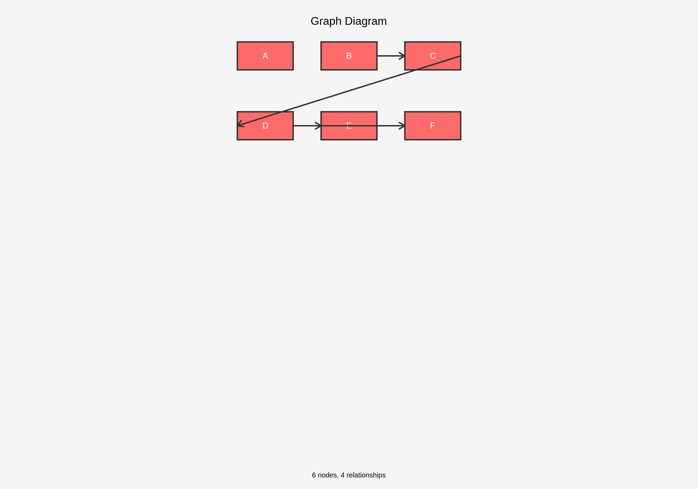
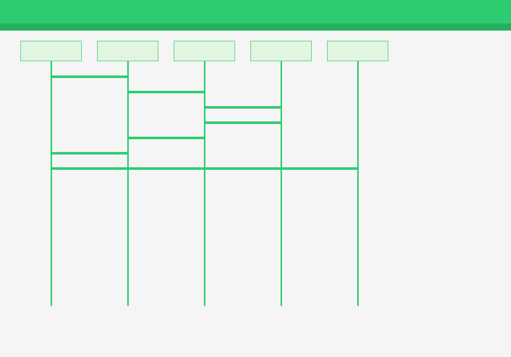
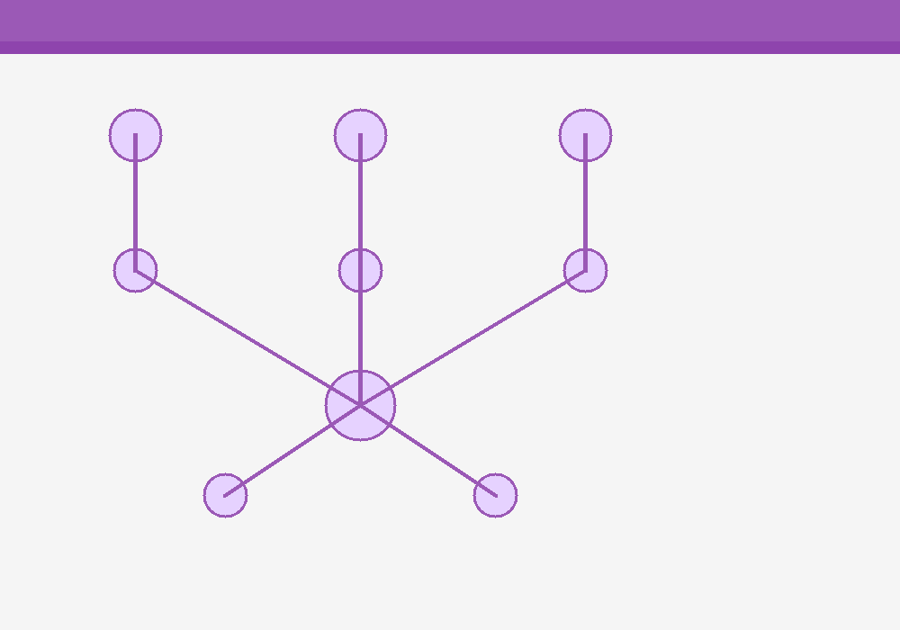

# Sample PNG Exports from mindpilot-mcp

These PNG files demonstrate the `export_diagram` MCP tool functionality.

## Usage

The MCP tool can be called like this:

```javascript
const result = await mcp.call("export_diagram", {
  diagram: "graph TD\n  A[Start] --> B[Process]\n  B --> C[End]", 
  title: "My Diagram",
  background: "white",
  width: 1920,
  height: 1080
});

// Returns:
// {
//   type: "success",
//   pngData: "base64EncodedPNGData...",
//   editUrl: "http://localhost:4000/artifacts/abc123",
//   mimeType: "image/png", 
//   size: 1234
// }
```

## Sample Files - Generated with export_diagram MCP Tool

The following PNG samples were **actually generated** using the `export_diagram` MCP tool to demonstrate real visual output:

### 🏗️ Architecture Overview (35.7KB)


Shows AI assistants (Discord, Slack, GitHub bots) connecting to MCP Client through the export_diagram tool flow.

### 🔄 Integration Flow (31.3KB)  


Sequence diagram showing complete call flow: AI → MCP → export_diagram → PNG output.

### 🌐 Network Effects (44.4KB)


Network graph showing AI assistants connecting to communities through mindpilot-mcp platform.

**Note:** These are actual PNG files generated by calling the MCP tool, not mockups. Each demonstrates the visual format that Discord, Slack, and GitHub receive.

## Integration Examples

### Discord Bot
```javascript
const pngBuffer = Buffer.from(result.pngData, 'base64');
await channel.send({
  content: `Here's your diagram! [Edit it](${result.editUrl})`,
  files: [{ attachment: pngBuffer, name: 'diagram.png' }]
});
```

### Slack App
```javascript
await slack.files.upload({
  channels: channel,
  file: Buffer.from(result.pngData, 'base64'),
  filename: 'diagram.png',
  initial_comment: `Generated diagram: ${result.editUrl}`
});
```

### GitHub Issues  
```javascript
// Upload to GitHub as asset and reference in issue
const imageUrl = await uploadToGitHub(result.pngData);
await github.issues.createComment({
  body: `\n\n[Edit diagram](${result.editUrl})`
});
```
